# cdm-rs — Architecture

| | |
|---|---|
| **Document** | `docs/ARCHITECTURE.md` |
| **Status** | Draft v1 |
| **Normative source** | [`SPEC.md`](./SPEC.md) — this document explains *how*; SPEC defines *what*. |

---

## 1. Architectural principles

| # | Principle | Consequence |
|---|---|---|
| P1 | **One definition, many projections** | The config model, the metric registry, the error catalogue and the API schema each exist exactly once as Rust types. Docs, JSON Schema, OpenAPI, the UI form, MCP tool schemas and CLI flags are all *generated*. |
| P2 | **Core is transport-agnostic** | `cdm-core` knows nothing about HTTP, MCP, A2A or the terminal. Every interface is a thin adapter over the same `CdmService`. |
| P3 | **Everything behind a trait** | Sources, sinks, codecs, features, filters, guardrails, jobs, tracking stores and metric exporters are all trait objects in one registry. Built-ins register through the same public path third parties use. |
| P4 | **Plan once, execute many** | Type conversions, statements, PK extraction and filter chains are resolved into an immutable `ExecutionPlan` at startup. The per-row hot path performs no lookups, no allocation of plans, no string formatting. |
| P5 | **The token range is the unit of everything** | Scheduling, tracking, resume, leasing, metrics attribution and failure isolation all key on the range. |
| P6 | **Bounded by construction** | Every queue, buffer and in-flight set has an explicit bound. There is no configuration that permits unbounded memory growth. |
| P7 | **Errors are data** | A single `Diagnostic` value renders identically as CLI text, `problem+json`, an SSE event and an MCP tool error. |
| P8 | **Compatibility is a feature, not an accident** | Java behavioural quirks that we improve upon are individually restorable via `--compat-java`, and every difference is documented and tested. |

---

## 2. System context

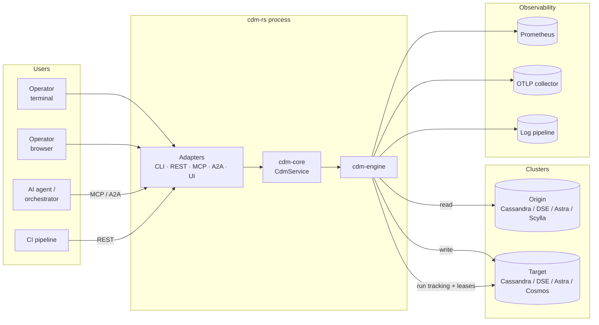

---

## 3. Crate topology

Sixteen crates, each independently testable, publishable and reusable. Arrows point from dependant
to dependency; there are **no cycles** and no crate depends on an adapter crate.

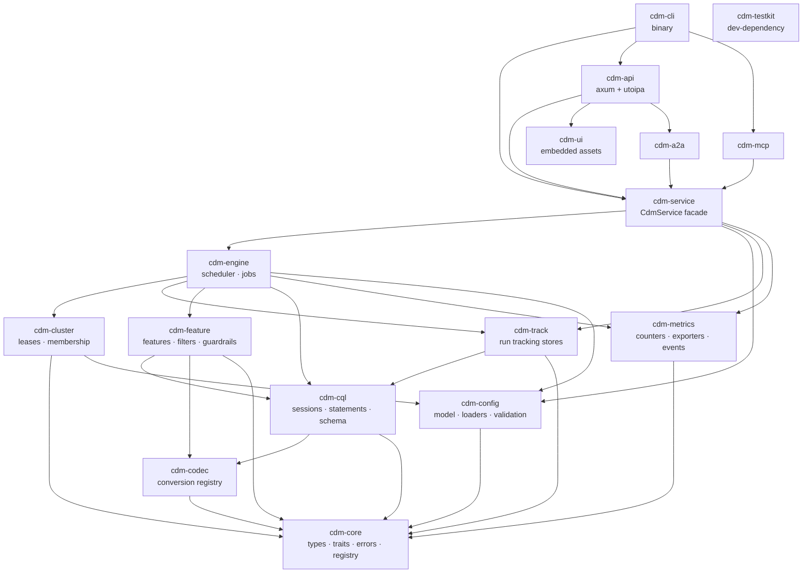

### 3.1 Crate responsibilities

| Crate | Responsibility | Key public items |
|---|---|---|
| `cdm-core` | Vocabulary of the domain. Zero I/O. | `TokenRange`, `PartitionRangeId`, `RunId`, `JobKind`, `RunStatus`, `Record`, `PrimaryKey`, `CdmError`, `Diagnostic`, `Registry`, and every plugin trait (`CodecPlugin`, `FeaturePlugin`, `FilterPlugin`, `GuardrailPlugin`, `JobPlugin`, `RowSource`, `RowSink`, `TrackingStore`, `LeaseStore`, `MetricsExporter`). |
| `cdm-config` | The one `CdmConfig` struct tree; loaders for TOML/YAML/JSON/`.properties`/env/CLI/API; the three validation tiers; JSON Schema generation; the best-practice rules engine. | `CdmConfig`, `ConfigLoader`, `Validator`, `Tier`, `PropertyRegistry`, `BestPractices` |
| `cdm-codec` | Type taxonomy, the conversion planner, the codec registry and all built-in codecs. | `CqlTypeInfo`, `ConversionPlan`, `Converter`, `CodecRegistry`, `codecs::*` |
| `cdm-cql` | **The only crate that depends on `scylla`.** Driver wrapper: connection building (TLS/SCB/Astra SNI), schema introspection, identifier quoting, statement construction and binding, paging, token-range CQL, and the compatibility shims of §6.1. | `Cluster`, `Side`, `SessionHandle`, `TableSchema`, `Statements`, `OriginSelect`, `TargetUpsert`, `TargetSelectByPk` |
| `cdm-feature` | All optional behaviours as plugins: constant columns, explode map, extract JSON, TTL/writetime, filters, guardrails. | `feature::*`, `FilterChain`, `GuardrailChain` |
| `cdm-track` | Run/range persistence and resume logic behind `TrackingStore`; Cassandra, SQLite and in-memory implementations. Also implements `LeaseStore` (`DST-010`..`DST-013`), because `cdm_run_leases` lives in the keyspace and beside the tables this crate already owns (`TRK-011`) — and because this is where the one sanctioned `scylla` exception is. | `RunTracker`, `CassandraStore`, `SqliteStore`, `MemoryStore` |
| `cdm-cluster` | Lease acquisition/renewal/expiry, membership, leader election, cross-node metric aggregation. **The policy only:** the conditional writes themselves are `cdm-core`'s `LeaseStore`, implemented by `cdm-track` beside the tracking tables the lease table belongs to (`TRK-011`), so no driver reaches this crate. | `Coordinator`, `Lease`, `NodeId`, `CoordinatorSettings`, `ReclaimPolicy`, `Membership` |
| `cdm-metrics` | Counter registry (parity + new), rate/latency instruments, event bus, Prometheus/OTLP exporters, the Java-format reporter, the TUI. | `Counters`, `CounterKind`, `Instruments`, `EventBus`, `Event`, `JavaFormatReporter`, `Tui` |
| `cdm-engine` | The scheduler, the three built-in jobs, batching, rate limiting, backpressure, retry, failure isolation, graceful shutdown. | `Engine`, `ExecutionPlan`, `RangeWorker`, `jobs::{Migrate, Validate, Guardrail}` |
| `cdm-service` | The transport-agnostic facade every adapter calls. Owns run lifecycle, idempotency, and the run registry. | `CdmService`, `SubmitRunRequest`, `RunHandle`, `RunView`, `PlanView`, `SchemaView` |
| `cdm-api` | axum HTTP server; `utoipa` OpenAPI generation; SSE; auth; problem+json; static UI mounting. | `serve()`, `ApiDoc` |
| `cdm-mcp` | MCP server (stdio + Streamable HTTP), tools/resources/prompts generated from `ApiDoc`. | `McpServer` |
| `cdm-a2a` | Agent card generation and A2A task adapter. | `AgentCard`, `A2aServer` |
| `cdm-ui` | The Config Builder + run monitor SPA, embedded via `rust-embed`. | `assets()` |
| `cdm-cli` | Argument parsing (`clap` derive, generated from the config model), output rendering, exit codes, the `cdm` binary. | `main` |
| `cdm-testkit` | Containers, generators, assertions, mock sessions. Dev-dependency only. | `OriginTarget`, `SchemaGen`, `DataGen`, `assert_counters!` |

### 3.2 Why this decomposition

* **`cdm-core` has no dependencies on I/O crates**, so plugin authors can implement traits without
  pulling in axum, the driver, or Tokio's full feature set.
* **`cdm-service` sits between the engine and every adapter**, which is what makes `TST-050`
  (identical behaviour across CLI/REST/MCP/A2A) structurally true rather than aspirational.
* **`cdm-config` does not depend on `cdm-cql`**; Tier-3 (schema-bound) validation is expressed as a
  trait (`SchemaProvider`) that `cdm-cql` implements. This keeps config parsing testable without a
  cluster and keeps the dependency graph acyclic.
* **`cdm-codec` does not depend on `cdm-cql`**; it operates on a driver-independent `CqlTypeInfo`
  and raw byte buffers, so codecs are unit-testable with no session and remain valid if the
  underlying driver is ever swapped.
* **`cdm-cql` and `cdm-engine` do not depend on `cdm-metrics`**, and `MET-010`'s per-request
  measurements still come from them, because the only place a request exists is the crate that
  issues it. The seam is `cdm_core::observe::RequestObserver` — the same shape as `SchemaProvider`
  above — which `cdm_metrics::Instruments` implements: `cdm-cql` times a driver request and
  `cdm-engine` reports a rate-limiter wait against `dyn RequestObserver`, and `cdm-cli` is the
  crate that holds both ends and joins them. `Operation` and `RetryCause` live in `cdm-core` for
  the same reason and are re-exported by `cdm-metrics`. **Do not add a `cdm-cql → cdm-metrics`
  edge** to "simplify" this: it puts the metric registry underneath the driver and is the change
  the trait exists to prevent.

### 3.3 The one edge that is optional: `cdm-testkit --features macrobench`

The graph above is the graph of a **default** build, and `cdm-testkit` sits at the bottom of it:
no driver, no engine, only `cdm-core`, `cdm-codec` and `cdm-metrics`. That is what lets
`cdm-cql`, `cdm-engine` and `cdm-track` all dev-depend on it without dragging the world into
every test build.

`TST-060`'s **tier-2 macro-benchmark** (`docs/BENCHMARKS.md` §1) is the single exception, and it
is a genuine one rather than a convenience. It measures rows per second for a whole migration
between two containerised clusters, which is only a measurement of cdm-rs if it drives the
shipping code: `cdm-engine`'s scheduler and migrate job, `cdm-cql`'s executor and statements,
`cdm-config`'s model. A harness built on a hand-rolled copy loop would report a number about the
harness.

```
cdm-testkit --features macrobench  -->  cdm-engine, cdm-cql, cdm-config
```

Three properties make this acceptable rather than a hole in the rule:

* **It is off by default.** Nothing in a default `cargo build`, `cargo test` or any other crate's
  dev-dependency resolution sees these edges. The graph in §3 is unchanged for every consumer
  that does not ask.
* **The resulting cycle is a dev-dependency cycle, which Cargo permits.**
  `cdm-engine → (dev) cdm-testkit → cdm-engine` is not a cycle in any crate's own build; only the
  test targets close it. `cargo check --workspace --all-targets --all-features` is the standing
  proof, and it is in CI.
* **It is confined to one module.** `crates/cdm-testkit/src/macrobench.rs` is the only file
  behind the feature. Nothing else in the crate may use `cdm-cql`, `cdm-engine` or `cdm-config`,
  feature or no feature.

**Do not widen it.** In particular, do not make the feature a default, and do not reach for
`cdm-cql`'s session from the rest of `cdm-testkit` because it is now nominally available: the
`TestSession` seam exists precisely so the fixtures stay driver-free, and `crates/cdm-cql/tests/
testkit_fixture.rs` is where the two halves are meant to meet.

The alternative considered and rejected was a separate `cdm-bench` crate. It would keep the graph
literally untouched, at the cost of a sixteenth-plus-one crate whose entire contents are one
module, and of splitting the container fixtures from the only other thing that starts containers.
If tier 3 (`NFR-004`'s Java comparison) ever needs a home in the workspace, that trade reverses
and the crate should be created then.

---

## 4. Configuration pipeline

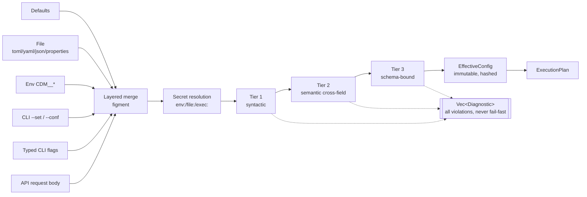

The `EffectiveConfig` is hashed (secrets excluded) to produce a `config_hash` used for
distributed-mode consistency checking (`DST-003`) and recorded in every run summary.

### 4.1 Single-source property definition

```rust
/// Performance and operational tuning.
#[derive(Debug, Clone, Serialize, Deserialize, JsonSchema, ToSchema, CdmProperties)]
pub struct PerfOps {
    /// Number of token-range splits the ring is divided into.
    ///
    /// Rule of thumb: `table_size / 10 MB`.
    #[cdm(legacy = "spark.cdm.perfops.numParts", default = 5000, min = 1)]
    pub num_parts: u64,

    /// Rows written per second, per node.
    #[cdm(legacy = "spark.cdm.perfops.ratelimit.target", default = 20_000, unit = "rows/s")]
    pub ratelimit_target: u32,
    // ...
}
```

The `CdmProperties` derive emits: the legacy-alias table used by the `.properties` loader, the
documentation row for `docs/generated/PROPERTIES.md`, the `clap` flag, and the UI form descriptor.
`JsonSchema` gives the config schema; `ToSchema` gives the OpenAPI component. **One struct, six
artefacts** — this is principle P1 in practice.

---

## 5. Execution model

### 5.1 Startup sequence

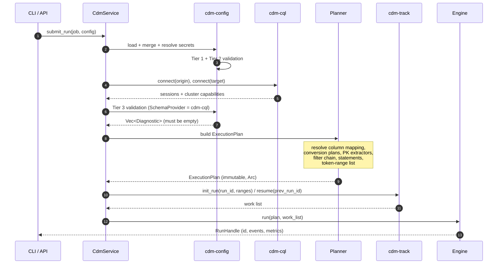

### 5.2 Scheduler

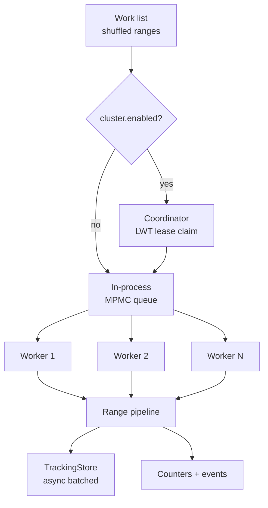

`perfops.workers` defaults to the CPU count. Workers are Tokio tasks on a multi-threaded runtime;
each owns one range at a time and drives an independent read→transform→write pipeline. Work stealing
is implicit: a free worker takes the next range, so straggler ranges do not idle the fleet.

### 5.3 Per-range pipeline (migrate)

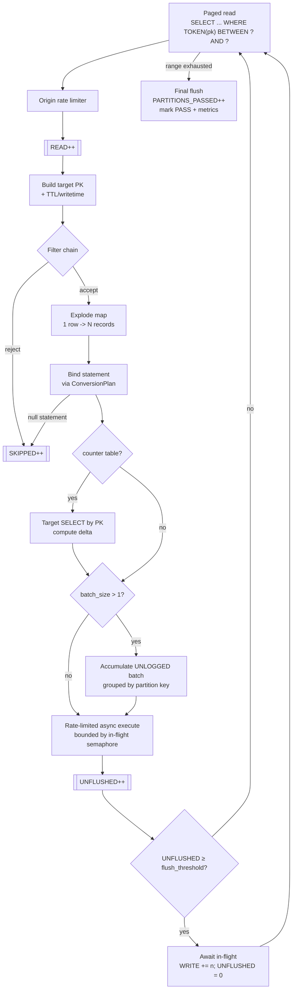

`flush_threshold = min(fetch_size, max(batch_size × 10, 100))` — identical to Java.

### 5.4 Per-range pipeline (validate)

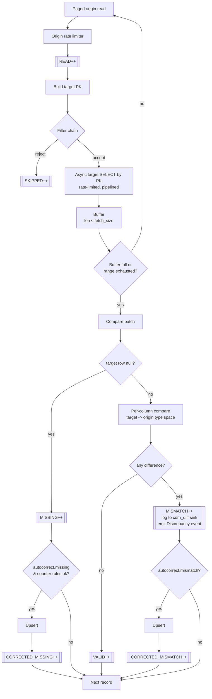

### 5.5 The hot path is allocation-light

Resolved once into `ExecutionPlan`, never per row:

| Resolved artefact | Type |
|---|---|
| Origin projection and prepared select | `PreparedStatement` |
| Target upsert (insert or counter update) | `PreparedStatement` |
| Column index mapping origin↔target | `Vec<Option<usize>>` |
| Per-column conversion | `Vec<ConversionPlan>` |
| PK extractor | `PkExtractor` (closure-free, index-driven) |
| Filter chain | `Vec<Box<dyn Filter>>` |
| TTL/writetime source indexes | `Vec<usize>` |
| Constant column literals | pre-rendered CQL fragment |

Per row we do: one iteration over target column indexes, a `ConversionPlan` dispatch (usually
`Passthrough`, which copies a `&[u8]` slice), and one bind. No hashing by column name, no
`format!`, no per-row `Vec` growth beyond the bind buffer, which is reused.

---

## 6. Type conversion architecture

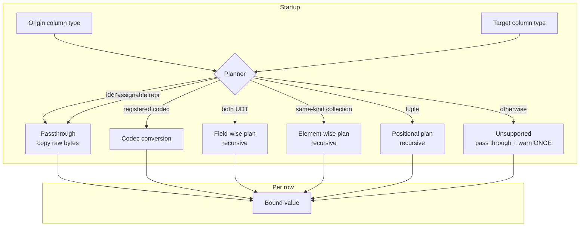

### 6.1 Driver: `scylla-rust-driver` and its compatibility shims

The CQL driver is [`scylla`](https://github.com/scylladb/scylla-rust-driver) — async, Tokio-native,
token-aware, shard-aware, with a well-typed serialization layer (`SerializeValue` /
`DeserializeValue`) that maps cleanly onto our conversion planner. Crucially it exposes raw column
bytes, which is what makes zero-copy passthrough (`MIG-040`) possible; a driver that eagerly
deserializes into owned values would forfeit the largest single performance win in the design.

It is a **Scylla-first** driver used against Cassandra/DSE/Astra, so `cdm-cql` owns four shims. All
four are confined to that crate, and each has a dedicated test module:

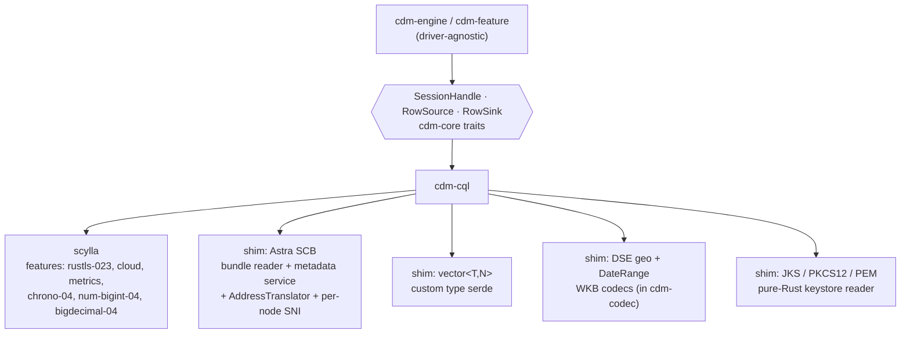

| Shim | Why | Approach |
|---|---|---|
| **Astra SCB** (`CON-003`, `CON-020`–`CON-029`) | The driver has **no** Astra SCB support. Its `cloud` feature implements the same *shape* of mechanism for Scylla Cloud, but against a different bundle layout and metadata contract. | Read the zip in memory, call the metadata service over mTLS, then drive the driver with a custom `AddressTranslator` and a per-connection TLS `ServerName` set to the node's host id. Detailed below and in `ADR-0009`. |
| **`vector<T,N>`** (`CDC-004`) | Cassandra 5 / Astra vector type is absent from Scylla's type system, so the driver surfaces it as a custom/unknown type. | `CqlTypeInfo::Vector { element, dimensions }` with our own serde over the raw bytes (fixed-width elements are a contiguous array; variable-width use the collection framing). Comparison is exact-bit, per `CDC-004`. |
| **DSE geometry + `DateRangeType`** (`CDC-003`) | DSE-only custom types. | WKB encode/decode implemented as ordinary `CodecPlugin`s in `cdm-codec`; the driver just carries bytes. |
| **JKS keystores** (`CON-006`) | Java CDM accepts `.jks`; there is no JVM to parse it. | Pure-Rust JKS reader (JCEKS/JKS magic, SHA-1 keyed digest verification, PKCS#8 extraction) plus PKCS#12 and PEM readers, feeding rustls. |

Everything above sits behind `cdm-core` traits, so replacing the driver later means rewriting one
crate, not the codebase. `TST-002` runs the full integration matrix against real Cassandra 4.1/5.0
**and** ScyllaDB to keep both dialects honest.

#### Astra secure-connect-bundle flow

Astra never exposes node addresses. The bundle carries mTLS material plus the address of a metadata
service; that service returns an SNI proxy address and the cluster's host ids. Every connection goes
to the one proxy endpoint, and the node it lands on is selected by the TLS SNI `server_name`. This is
the mechanism `scylla-rust-driver` lacks, so `cdm-cql` implements it.

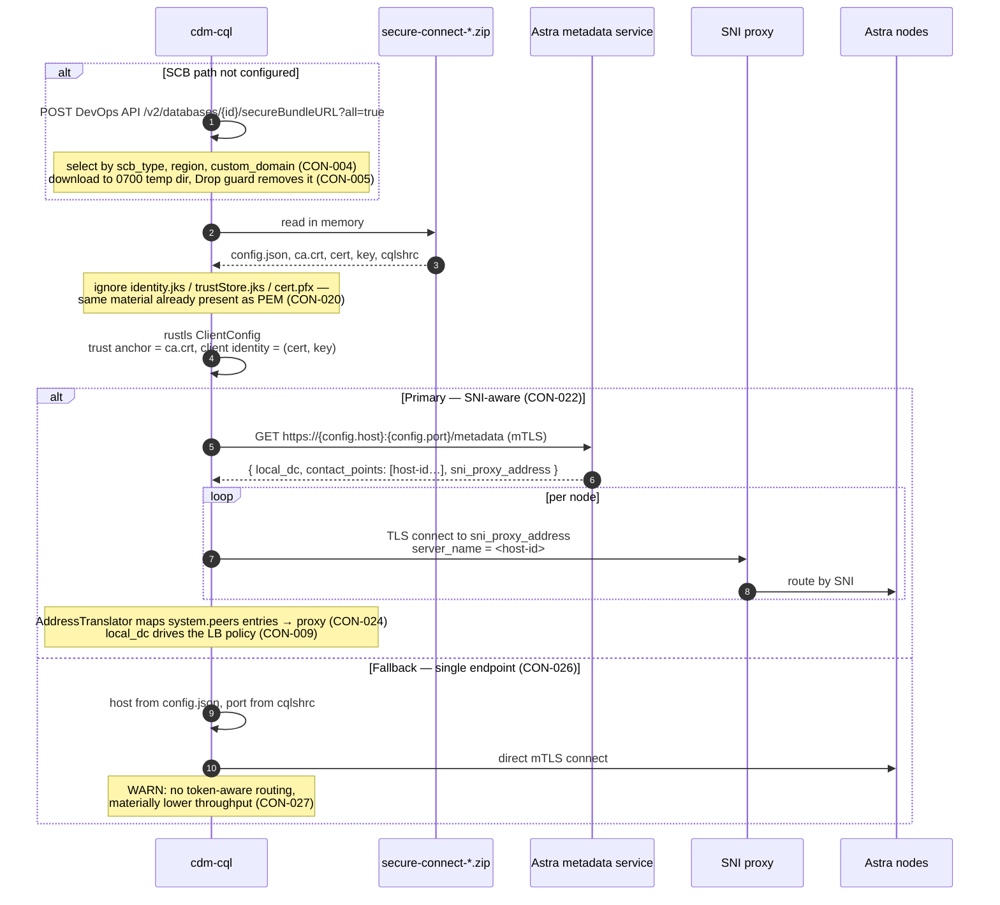

Two details are easy to get wrong and are therefore normative: the CQL port comes from `cqlshrc`,
**not** from `config.json` (the other ports in the bundle do not serve CQL), and the metadata
response must be re-fetched — rate-limited — when every connection fails, because
`sni_proxy_address` can change (`CON-025`).

---

`ConversionPlan` is a recursive enum; nesting is resolved at startup so a
`map<text, frozen<list<udt>>>` conversion costs one dispatch chain per row with no type inspection.

The **codec registry** is keyed by `(from: CqlTypeInfo, to: CqlTypeInfo)` and populated by
`CodecPlugin`s. `BIGINT_BIGINTEGER` is always registered (needed to read collection writetimes);
the rest are opt-in via `transform.codecs`, exactly as in Java.

---

## 7. Run tracking and resume

### 7.1 State machine

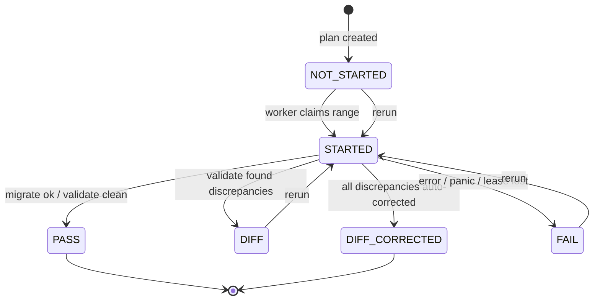

Run-level status mirrors this and terminates at `ENDED` (Java parity), with cdm-rs adding
`INTERRUPTED` and `ABORTED` on the run row only.

### 7.2 Resume

`auto_rerun` selects the newest run for `(table_name, run_type)` and adopts it if it did not reach
`ENDED`, or if its `run_info` reports `Partitions Failed: N > 0`. Pending ranges are those in
`{NOT_STARTED, STARTED, FAIL, DIFF}`. `rerun_multiplier` subdivides each pending range to break up
stragglers. If the previous run's info row is missing or `NOT_STARTED`, we fall back to a fresh full
plan with a warning — matching Java's `RunNotStartedException` path.

Resume correctness rests on migrate being **idempotent**: upserts carry the origin's writetime, so
re-writing a row is a no-op at the storage layer. The two exceptions are documented and handled:
unfrozen lists (mitigated by `transform.custom_writetime_increment`, warned about by `CFG-039`) and
counters (`DST-015`).

### 7.3 Pluggable stores

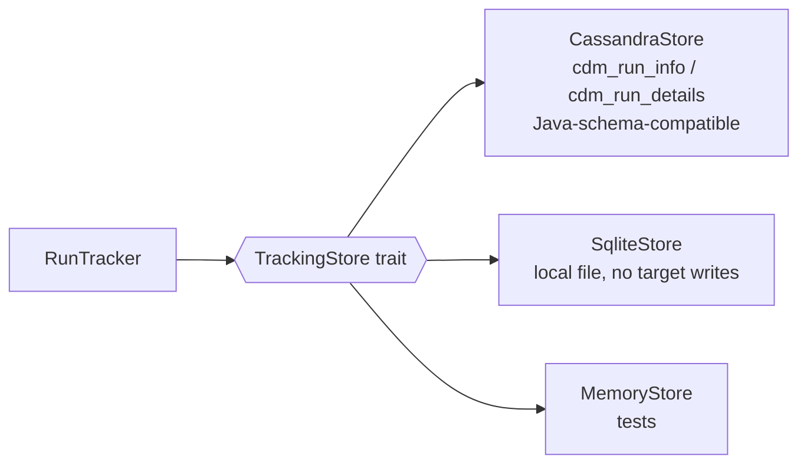

Writes are enqueued to a bounded channel and flushed in batches by a dedicated task, so tracking can
never become the throughput bottleneck. On overflow the tracker degrades to periodic checkpoints and
logs a warning rather than applying backpressure to data movement.

---

## 8. Distributed coordination

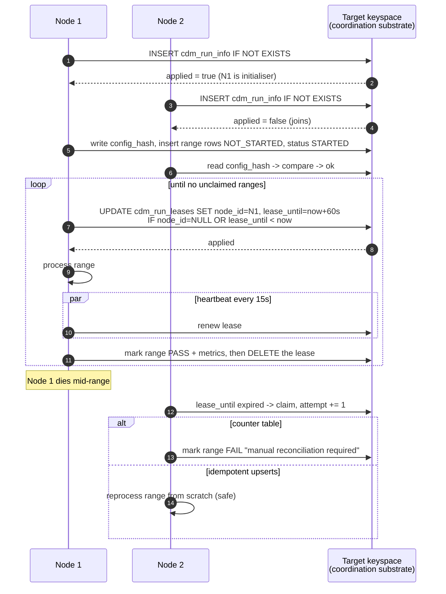

Design notes:

* **No external dependency.** Coordination lives in the target keyspace, which is already required.
  No ZooKeeper, etcd, Raft, or message broker.
* **LWT cost is bounded.** One LWT per range claim and one per renewal cycle — not per row. With the
  default 5000 ranges and 60 s leases, this is negligible next to the data traffic.
* **Failure is the normal case.** A node dying is indistinguishable from a slow node; leases handle
  both. `cluster.max_attempts` prevents infinite reclaim loops.
* **Counters are explicitly excluded** from safe reclaim, because counter updates are not idempotent.
  We fail loudly rather than corrupt silently.
* **Metrics aggregate through the same substrate**: each node checkpoints its counter snapshot; the
  node that observes the final range completing prints the Java-format summary.

---

## 9. Metrics and event architecture

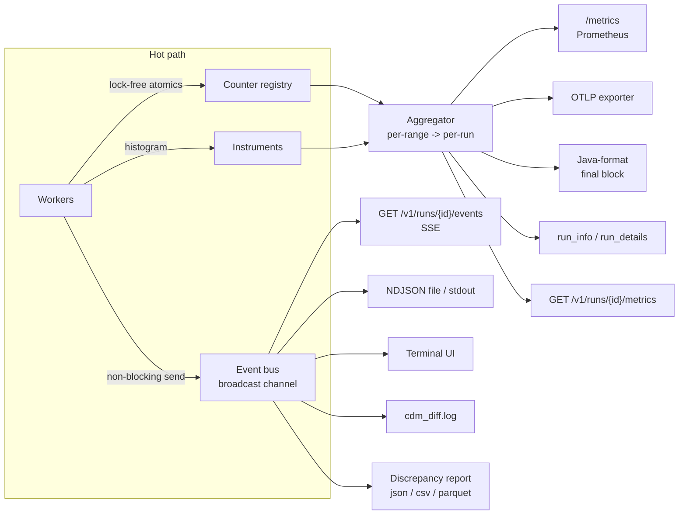

Counters are `AtomicU64` in a fixed-size array indexed by a `CounterKind` enum — no map lookup, no
lock, no contention beyond the cache line. The two-level interim/committed model from Java is
preserved because per-range `run_info` strings depend on it.

The event bus is a bounded `tokio::sync::broadcast`. Slow consumers lag and are told so; they never
apply backpressure to the data path.

---

## 10. Interface architecture — one core, many transports

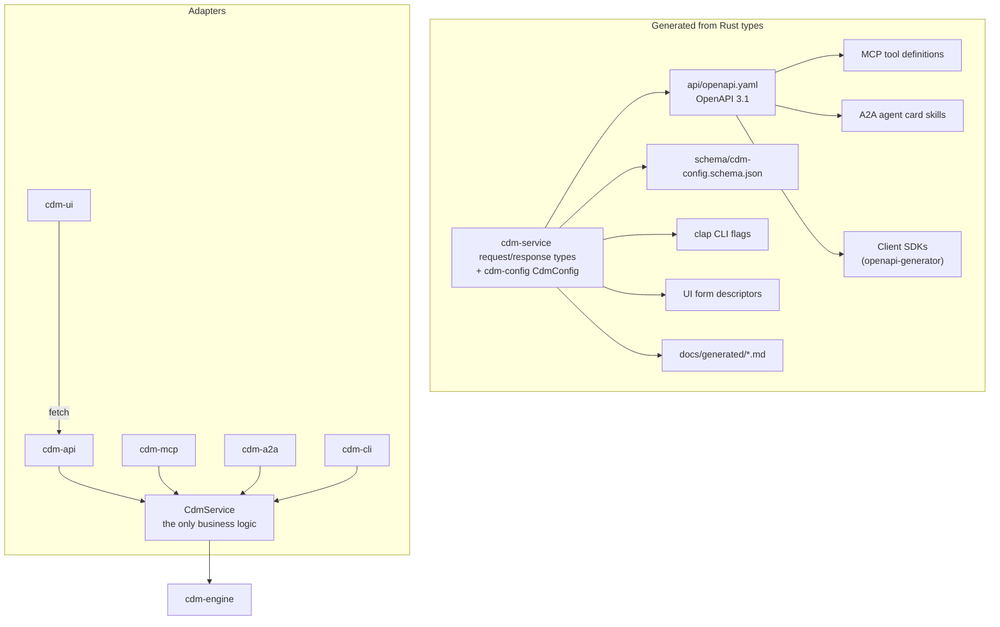

**This is the answer to "extensible to MCP, A2A, etc."**: adapters are mechanical translations. A new
transport (gRPC, AsyncAPI over Kafka, a Slack bot) is a new crate that calls `CdmService` and, if it
needs a schema, reads the generated OpenAPI document. `TST-050` asserts all adapters agree.

### 10.1 OpenAPI generation and drift control

```text
cargo xtask openapi          # regenerate api/openapi.yaml + schema/*.json
cargo xtask openapi --check  # CI: fail if the checked-in files drift
oasdiff breaking base.yaml api/openapi.yaml   # CI: fail on undeclared breaking changes
```

Operations carry vendor extensions consumed by the generators:

```yaml
x-mcp:
  expose: tool
  destructive: true          # -> MCP destructiveHint
  idempotent: true           # -> MCP idempotentHint
x-a2a:
  skill: run-migration
x-cli:
  command: "runs resume"
```

### 10.2 Run lifecycle as seen by every transport

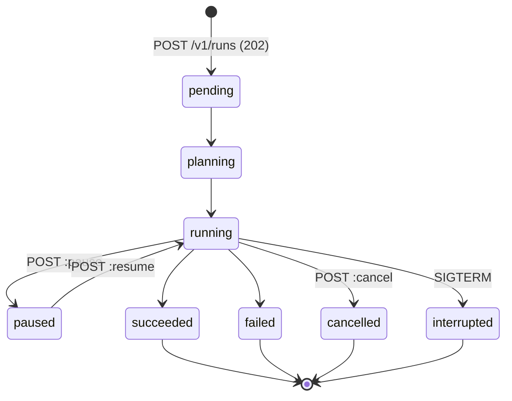

---

## 11. Plugin architecture

```rust
pub trait FeaturePlugin: Send + Sync + 'static {
    fn name(&self) -> &'static str;
    /// Contribute config keys; they flow into JSON Schema, OpenAPI, docs and the UI.
    fn config_schema(&self) -> Option<schemars::Schema> { None }
    /// Tier 2 + Tier 3 participation.
    fn validate(&self, cfg: &EffectiveConfig, schema: &SchemaPair) -> Vec<Diagnostic>;
    fn is_enabled(&self, cfg: &EffectiveConfig) -> bool;
    /// Contribute extra origin projection columns (e.g. TTL(col), WRITETIME(col)).
    fn extend_origin_projection(&self, _b: &mut ProjectionBuilder) {}
    /// Contribute target columns / literals.
    fn extend_target_binding(&self, _b: &mut BindingBuilder) {}
    /// Transform one origin record into zero or more output records.
    fn transform(&self, _rec: Record, _out: &mut RecordSink) -> Result<(), CdmError> { Ok(()) }
    /// Participate in validate comparison (e.g. skip constant columns).
    fn compare_hook(&self) -> Option<&dyn CompareHook> { None }
}
```

All ten built-in features implement this trait and are registered through the public
`Registry::register_feature` — there is no privileged internal path. The registry is built once at
startup:

```rust
let registry = Registry::builder()
    .with_builtin_codecs()      // CDC-020
    .with_builtin_features()    // FEA-*
    .with_builtin_jobs()        // migrate, validate, guardrail
    .with_plugins(cfg.plugins()) // PLG-011, opt-in
    .build()?;
```

Registration order is deterministic; conflicting registrations are a startup error naming both
providers.

---

## 12. Concurrency and memory model

| Concern | Mechanism | Bound |
|---|---|---|
| Worker parallelism | Tokio multi-thread runtime, `perfops.workers` tasks | configured |
| In-flight origin pages | semaphore | `perfops.max_inflight_reads` |
| In-flight target writes | semaphore | `perfops.max_inflight_writes` |
| Validate compare buffer | per-worker `Vec` | `perfops.fetch_size` records |
| Batch accumulation | per-worker map keyed by partition token | `perfops.batch_size` × distinct partitions in flight |
| Tracking writes | bounded mpsc + batching task | 4096 entries, then checkpoint-degrade |
| Event bus | bounded broadcast | 8192 events, slow consumers lag |
| Discrepancy report | streaming writer, never buffered whole | O(1) |

Steady-state RSS is therefore `base + workers × (fetch_size × row_size + inflight × row_size)` and is
computable from the config — which is what `NFR-003` requires and what `cdm plan` prints.

Blocking work (JKS parsing, file I/O, SCB extraction) runs on `spawn_blocking`; the async runtime is
never blocked.

---

## 13. Error handling and failure isolation

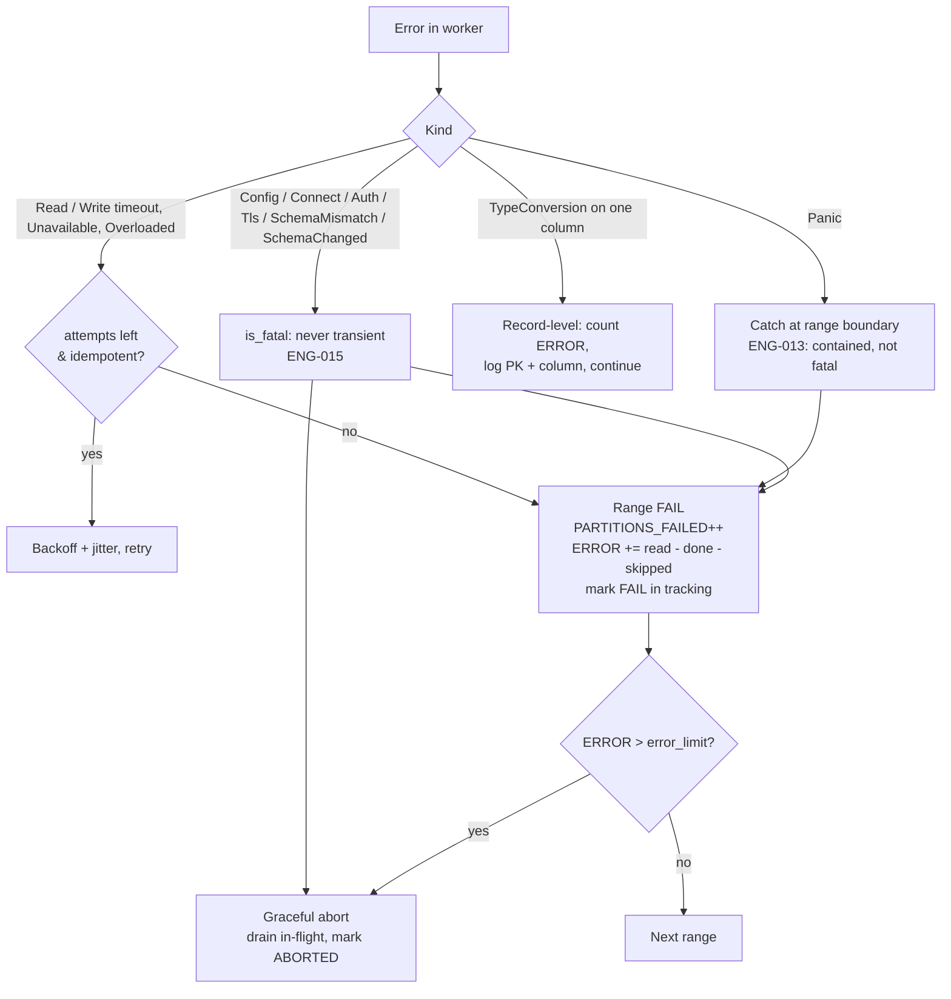

Three isolation levels — record, range, run — mean a single bad row cannot fail a range, and a single
bad range cannot fail a run. Everything a failed range touched is re-runnable, because the range is
the tracking unit.

The fatal path is not a fourth level but a short circuit through the third: the range is still marked
`FAIL` and still accounted for, and what changes is only that no further range is claimed. The
distinction is easiest to see in what each abort *means*. An error-limit abort says a lot of rows
failed; a fatal abort says one thing about the run is wrong, and would say it again for every
remaining range if isolation were applied to it. A panic is the deliberate exception: `ENG-013`
contains it even though it surfaces as `Internal`, because a payload caught inside `catch_unwind`
tells you about one range and not about the run.

---

## 14. Security architecture

* Secrets are `Secret<String>` throughout; `Debug`, `Display` and `Serialize` all emit `***`.
  Resolution (`env:`/`file:`/`exec:`) happens once, at load, into memory that is zeroized on drop.
* The control plane defaults to loopback with no auth, and **refuses** to bind a non-loopback address
  without either auth configured or an explicit `insecure_allow_remote` opt-in.
* MCP and A2A share the API's auth layer — there is no second, weaker door.
* `#![forbid(unsafe_code)]` workspace-wide.
* Supply chain gates (`cargo-deny`, `cargo-audit`, gitleaks, CodeQL, SBOM, signed artefacts) run in
  CI on every PR and every release.
* The container image is distroless, non-root, and contains only the binary.

---

## 15. Deployment topologies

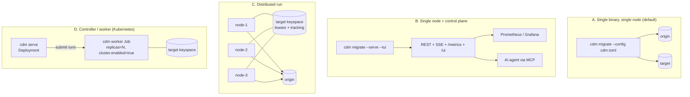

All four topologies run the **same binary** with different flags. There is no separate driver
artefact, no executor artefact, and no cluster manager to install.

---

## 16. Architecture decision records

ADRs live in `docs/adr/` and are referenced from requirements. Planned for PR #1–#3:

| ADR | Decision |
|---|---|
| `ADR-0001` | Replace Spark with a native Tokio scheduler; token range remains the unit of work. |
| `ADR-0002` | Adopt `scylla-rust-driver` as the sole CQL driver; confine it to `cdm-cql`; implement the four compatibility shims (Astra SNI, `vector<>`, DSE geo/date-range, JKS). |
| `ADR-0003` | Lease-based distributed coordination in the target keyspace; no external coordinator. |
| `ADR-0004` | OpenAPI generated from Rust types as the single interface source of truth. |
| `ADR-0005` | Config as one typed struct tree with generated projections; `.properties` compatibility layer. |
| `ADR-0006` | Conversion plans resolved at startup; zero-copy passthrough as the default fast path. |
| `ADR-0007` | Counter tables: no retry, no distributed reclaim, no batching — correctness over throughput. |
| `ADR-0008` | Java-identical metric strings and tracking-table schema as a hard compatibility contract. |
| `ADR-0009` | Implement Astra secure-connect-bundle support in `cdm-cql`: SNI-aware primary strategy, single-endpoint fallback. |

---

## 17. Mapping: Java component → cdm-rs home

| Java / Scala component | cdm-rs |
|---|---|
| `BaseJob`, `BasePartitionJob` (Spark drivers) | `cdm-engine::Engine` + `cdm-service::CdmService` |
| `Migrate`, `DiffData`, `GuardrailCheck` objects | `cdm-engine::jobs::{Migrate, Validate, Guardrail}` behind `JobPlugin` |
| `SplitPartitions` | `cdm-engine::planner` (`TOK-003`) |
| `PartitionRange` | `cdm-core::TokenRange` + `RangeState` |
| `JobCounter`, `CounterUnit`, `CDMMetricsAccumulator` | `cdm-metrics::Counters` (+ exporters, event bus) |
| `ConnectionFetcher`, `ConnectionDetails` | `cdm-cql::connect` |
| `AstraDevOpsClient` | `cdm-cql::astra` |
| `EnhancedSession`, `cql/statement/*` | `cdm-cql::{SessionHandle, statements}` |
| `CqlTable`, `BaseTable`, `Table` | `cdm-cql::schema::TableSchema` |
| `CqlData`, `CqlConversion`, `cql/codec/*` | `cdm-codec` |
| `PKFactory`, `EnhancedPK`, `Record` | `cdm-core::{PrimaryKey, Record}` + `cdm-engine::PkExtractor` |
| `feature/*` | `cdm-feature` (each a `FeaturePlugin`) |
| `TrackRun`, `TargetUpsertRunDetailsStatement` | `cdm-track` |
| `KnownProperties`, `PropertyHelper` | `cdm-config` (generated from `CdmConfig`) |
| `DataUtility` | split across `cdm-codec` (diff/format) and `cdm-cql` (identifiers, SCB) |
| log4j2 `ThreadContext` labels | `tracing` spans (+ Java-compatible label rendering) |
| `SIT/*.sh` harness | `cdm-testkit` + `tests/sit/` |
| `cdm-config-builder` (React) | `cdm-ui` + server-side `BestPractices` in `cdm-config` |
| Spark `spark-submit` | `cdm <subcommand>` |
| — | **new:** `cdm-service`, `cdm-api`, `cdm-mcp`, `cdm-a2a`, `cdm-cluster` |

---

## 18. What we deliberately do differently

| Java behaviour | cdm-rs | Why | Restore with |
|---|---|---|---|
| Unknown consistency level silently becomes `LOCAL_QUORUM` | hard error | silent weakening of consistency is a data-safety hazard | `--compat-java` |
| `ALLOW FILTERING` always appended | omitted when no CQL filter | a pure token scan does not need it; it can mask planner problems | `--compat-java` |
| UDT conversion via `format`/`parse` round-trip, positional | recursive, name-matched | lossy for nested and non-round-trippable types | `--compat-java` |
| Tuple element conversion unsupported | implemented | closes a real gap | — |
| Counter writes retried by driver policy | never retried; range fails | retrying a counter increment double-counts | — |
| `errorLimit` documented but unimplemented | implemented | users expect the documented behaviour | set to `0` |
| Batches formed in row order across partitions | grouped by partition key | multi-partition batches are a well-known anti-pattern | `perfops.batch_grouping = legacy` |
| Metrics only at end of run, via logs | live counters, Prometheus, OTLP, SSE, TUI | observability was the top operational complaint | — |
| Config errors surface at runtime | three validation tiers up front, all errors at once | fail in seconds, not hours | — |
| Requires JVM + exact Spark version | single static binary | eliminates the #1 support issue | — |
