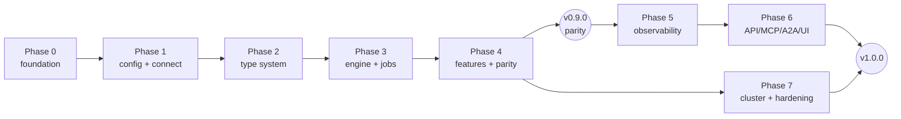

# cdm-rs — Delivery Roadmap (PR plan)

| | |
|---|---|
| **Document** | `docs/ROADMAP.md` |
| **Normative source** | [`SPEC.md`](./SPEC.md) |
| **Traceability** | [`TRACEABILITY.md`](./TRACEABILITY.md) |

Every unit of work below is **one pull request**. Every PR:

* targets `main` via branch protection (no direct pushes, squash merge only);
* is titled with Conventional Commits (`feat(engine): ...`);
* carries an `Implements: <REQ-IDs>` trailer;
* updates `docs/TRACEABILITY.md` in the same PR (CI gate `OPS-011`);
* is green on `ci`, `coverage`, `security`, and — from Phase 2 — `integration` and `sit`;
* is reviewable in isolation: no PR leaves `main` in a non-compiling or non-testable state.

Parity (Phases 1–4) ships **before** the new interface surface (Phases 5–7). That ordering is
deliberate: functional parity is the hard gate, everything else is additive.

## Where delivery has reached

Roadmap PR numbers below are **not** GitHub pull-request numbers; several roadmap items were
delivered as one PR where splitting them would have merged a knowingly-wrong intermediate state.

| Roadmap PRs | State |
|---|---|
| #1–#20, #27–#31, #36–#39 | **Delivered.** Docs and scaffolding, the driver spike, `cdm-core`, all of `cdm-config`, all of `cdm-codec`, `cdm-cql` through statement construction, the CLI skeleton, the testkit, the token planner, the scheduler, and metrics through the event bus and the terminal UI. |
| #21–#26 | **Delivered.** The three jobs (migrate with counters, validate with autocorrect, guardrail), run tracking with resume and rerun, the error limit and graceful shutdown. |
| #32 | **Delivered.** All nineteen Java SIT cases ported to a declarative harness under `tests/sit/`, driven against a container by `cargo xtask sit`, with `sit.yml` restored to `push: [main]` and a nightly schedule. Ten cases ran and passed on delivery; the nine that reported `BLOCKED` each named the `cdm-cli` wiring they waited on — every one of them the same four defaulted arguments in `crates/cdm-cli/src/harness/build.rs`. #21c, #21d and #21e supplied those arguments, and #21f closed the last gap — validate looked a target row up once per record where an explode map produces one per map *entry*. All nineteen cases now run and pass; none is `BLOCKED`. |
| #33–#35, #40–#49, #51, #52, #54, #56–#58 | **Not started.** The property and differential harnesses, `--compat-java`, the service facade, the API/MCP/A2A/UI surface, the rest of the distributed work, and the release machinery. |
| #55 | **Partially delivered.** Tier 1: `criterion` micro-benchmarks over the hot path (`TST-060`), and `bench.yml` restored to a nightly schedule with a `bench` opt-in label. Tier 2: the containerised macro-benchmark, `cargo xtask bench`, plus a weekly `bench.yml` job that records end-to-end rows per second into its own trend series. That job is deliberately **not** a gate — throughput on a shared runner tracks the runner, not the commit. Tier 3: `bench/java-comparison/` and the fortnightly `java-comparison.yml`, which runs Java CDM and cdm-rs over the same dataset on the same runner, back to back, with fresh containers for each implementation, alternating order, cold and steady-state reported separately, and both targets verified by an independent `SELECT COUNT(*)` and a full `cdm validate` before either number counts. It emits JSON per run plus a rendered table, and never emits a ratio against a failed or partial Java run. Two things remain, and `docs/BENCHMARKS.md` says so rather than implying otherwise. First, **`NFR-004`'s ≥ 2× claim is still unmeasured**: the harness exists and is scheduled, but no run has happened yet, and §5's results section is deliberately empty until one has. Second, `TST-060`'s "regressions > 10% MUST fail CI" is **not met** — wall-clock variance on a shared `ubuntu-latest` runner is routinely 10–30%, so a 10% threshold detects noise, not regressions. The gate ships at 200%, which catches lost fast paths and accidental quadratics; closing the gap honestly needs instruction-count benchmarking (`iai-callgrind`). |
| #50 | **Delivered.** The lease-based coordinator (`DST-001`..`DST-003`, `DST-010`..`DST-013`): `cdm-core` gains the `LeaseStore` trait, `cdm-track` implements it over `cdm_run_leases` with `SERIAL` lightweight transactions, and `cdm-cluster` holds the policy — election, the `DST-003` configuration-hash check, claiming, renewal, expiry, reclaim and `cluster.max_attempts`. The coordinator is **not yet wired into the scheduler**: `cdm-engine`'s `WorkQueue` is untouched, so a run is still single-process, and `cdm cluster` still returns "not yet" because the membership rows and per-node counters it lists are `DST-016`..`DST-018`. Reclaim safety for counter tables (`DST-014`, `DST-015`) is #51 and is left as a seam — `ReclaimPolicy` has no default, so a caller must state whether a reclaim is safe for the table in hand. |
| #53 | **Delivered.** Adaptive rate limiting (`ENG-006`) and the two planning strategies that needed cluster metadata (`TOK-008`, `TOK-010`). `perfops.adaptive_ratelimit` hands the target write rate to an AIMD controller fed by the target's own overload reports; `plan.strategy` and `plan.max_rows_per_range` became configuration, and `ring_aware`/`adaptive` plan against the origin's real ring, read once through `cdm-cql::ring`. #17 had already written the two splitters; what was missing was the configuration to reach them and the cluster metadata to feed them. |

**That gap is now closed.** The shared *connect → introspect → plan → run* path had no roadmap PR
of its own: it was assumed into #21–#24 and fell between them, because each job could be built and
tested against a `RangeProcessor` seam without it. It is tracked as **#21a** below and has landed,
along with **#21b**, which wires the remaining commands and the flags that had been parsed and
ignored. `cdm migrate`, `cdm validate` and `cdm plan` now run; so do `cdm connect test`,
`cdm schema show|diff`, `cdm codecs`, `cdm config init` and `cdm runs list|show|cancel`.

**#21c** closes what those two left open. The harness they built accepted a validated `feature.*`
block and then discarded it at the point of use, building every job with `MappingOptions::default()`,
`MigrateFeatures::default()`, `MissingKeyPolicy::default()` and a codec registry with no format
options — so the features delivered by #27–#31 were reachable from a library test and from nowhere
else, and a run configured with them reported success while writing rows that did not carry them.
#21c wires the configuration through, and — on the paged origin reader `CqlOriginRows` now provides
— implements `cdm guardrail`.

**#21g** makes `cdm runs resume` real. It was blocked on the scheduler accepting a
pre-computed range set: `cdm-track` computed the outstanding ranges already, but a `TokenPlan` could
only be built by splitting the ring, so "resuming" would have meant re-planning everything. `TOK-011`
adds that constructor, the harness records runs so there is something to resume from
(`TRK-020`..`TRK-022`), and `TRK-038`/`TRK-039` say what a resumed run's counters mean and what it
must do with the ranges `DST-015` will not let it replay.

Two commands still return "not yet", and each is blocked on something nameable rather than on
wiring: `cdm cluster` on the membership and per-node counter rows of #51 (#50 delivered the leases
it would otherwise list, but not the rows), and `cdm serve` and `cdm mcp` on #41–#45.

---

## Phase 0 — Foundation

| PR | Title | Implements | Notes |
|---|---|---|---|
| #1 | `docs: specification, architecture, traceability and repo scaffolding` | — | **This PR.** SPEC/ARCHITECTURE/TRACEABILITY/ROADMAP, ADR-0001 through ADR-0005 and ADR-0009, Cargo workspace with all 16 crates stubbed, workspace lints, `rustfmt.toml`, `clippy.toml`, `deny.toml`, `.pre-commit-config.yaml`, `xtask`, CI workflows, CODEOWNERS, templates, README, LICENSE. |
| #2 | `feat(cql): driver spike — scylla-rust-driver capability assessment` | `CON-000`, `ADR-0002` | Time-boxed spike proving: connect to Cassandra 4.1/5.0 + Scylla + Astra; read/write every CQL type incl. `vector<>`, UDT, tuple, DSE geo; raw-bytes access for passthrough; `UNSET` binding; paging; token-range queries. Produces `ADR-0002` and, if needed, upstream issues. Merged as a documented spike + integration test, not throwaway. |
| #3 | `feat(core): domain vocabulary, error model and plugin registry` | `ERR-001`..`ERR-004`, `PLG-001`..`PLG-013` | `cdm-core`: `TokenRange`, `Record`, `PrimaryKey`, `RunId`, `JobKind`, `RunStatus`, `CdmError`, `Diagnostic`, all plugin traits, `Registry`. 100% unit tested, zero I/O deps. |

## Phase 1 — Configuration and connectivity

| PR | Title | Implements |
|---|---|---|
| #4 | `feat(config): typed config model with generated projections` | `CFG-001`..`CFG-003`, `CFG-100`..`CFG-200` — **also implements `cargo xtask docs` for real** |
| #5 | `feat(config): layered loaders incl. Java .properties compatibility` | `CFG-010`..`CFG-013`, `CLI-002` |
| #6 | `feat(config): three-tier validation with full diagnostic reporting` | `CFG-020`..`CFG-040`, `CFG-161` |
| #7 | `feat(cql): connection building, TLS, keystores` | `CON-001`, `CON-002`, `CON-006`, `CON-007`, `CON-009`, `CON-010` |
| #8 | `feat(cql): Astra secure-connect-bundle, SNI routing and DevOps API` | `CON-003`, `CON-004`, `CON-005`, `CON-020`..`CON-028` |
| #9 | `feat(cql): schema introspection and identifier handling` | `SCH-001`, `SCH-002`, `SCH-010`, `CON-013` |
| #10 | `feat(cli): skeleton binary, config subcommands, exit codes` | `CLI-001`, `CLI-003`..`CLI-007`, `CON-008`, `CON-029`, `SCH-008` |

## Phase 2 — Type system

| PR | Title | Implements |
|---|---|---|
| #11 | `feat(codec): CQL type taxonomy and conversion planner` | `CDC-001`, `CDC-002`, `CDC-010`..`CDC-012`, `CDC-016` |
| #12 | `feat(codec): built-in codec set with Java-identical semantics` | `CDC-020`, `CDC-021`, `CDC-030`, `CDC-031` |
| #13 | `feat(codec): Java date/decimal format translation` | `CDC-022` |
| #14 | `feat(codec): UDT, tuple, collection and vector conversion` | `CDC-004`, `CDC-013`..`CDC-015`, `CDC-032` |
| #15 | `feat(codec): zero-copy passthrough fast path` | `MIG-040`, `TST-030` |
| #16 | `feat(testkit): containers, generators, counter assertions` | `TST-100`..`TST-102` — the `pull_request`/`push` triggers on `integration.yml` were already restored by #2, which gave the workflow something to run first; #16 gives it the shared harness and implements `cargo xtask it` |

## Phase 3 — Core engine and parity jobs

| PR | Title | Implements |
|---|---|---|
| #17 | `feat(engine): token-range planner` | `TOK-001`..`TOK-007`, `TOK-009` |
| #18 | `feat(cql): statement construction and binding` | `SCH-003`..`SCH-007`, `FEA-060`..`FEA-062`, `MIG-010`..`MIG-014`, `ERR-005` |
| #19 | `feat(metrics): counter registry and Java-format reporter` | `MET-001`..`MET-006` |
| #20 | `feat(engine): scheduler, rate limiting, backpressure, failure isolation` | `ENG-001`..`ENG-013` |
| #21 | `feat(engine): migrate job` | `MIG-001`..`MIG-005`, `MIG-020`..`MIG-022`, `MIG-041` |
| #22 | `feat(engine): counter table support` | `SCH-005`, `MIG-030`..`MIG-032`, `CON-011`, `CON-012` |
| #23 | `feat(engine): validate job with autocorrect` | `VAL-001`..`VAL-012`, `VAL-016`, `VAL-017` |
| #24 | `feat(engine): guardrail job` | `GRD-001`..`GRD-004` |
| #25 | `feat(track): run tracking, resume and rerun` | `TRK-001`..`TRK-003`, `TRK-010`, `TRK-012`, `TRK-020`..`TRK-036` |
| #26 | `feat(engine): error limit and graceful shutdown` | `ENG-009`, `ENG-010`, `ENG-014` |
| #21a | `feat(cli): the shared job harness — connect, introspect, plan, run` | `CLI-001`, `CON-008`, `SCH-001`, `SCH-008`, `TOK-001`, `MET-005` (wiring only; no new requirements) — **the one piece standing between the implemented jobs and a usable `cdm` binary.** Turns a validated `CdmConfig` into two sessions, an introspected schema, a conversion plan, a token plan and a scheduler run, then renders the counter block and maps the terminal status onto a `CLI-004` exit code. Wires `cdm migrate`, `cdm validate` and `cdm plan`. `cdm guardrail` is left blocked on a paged origin reader, and tier-3 `cdm config validate` on a caller for the session the harness now opens. |
| #21b | `feat(cli): the discrepancy-report flags and the remaining commands` | `CLI-001`, `CLI-004`..`CLI-006`, `CFG-023`, `CON-008`, `CON-029`, `SCH-008`, `CDC-031`, `TRK-034`, `VAL-013`, `VAL-015`, `MET-033` (wiring only; no new requirements). Makes `--summary-out` write the `MET-033` document with the `CFG-023` hash and the `VAL-013` report pointer, and adds `--sample` and `--keys-only` as the configuration sugar `VAL-015` specifies. Implements `cdm connect test`, `cdm schema show\|diff`, `cdm codecs`, `cdm config init` and `cdm runs list\|show\|cancel`. `cdm runs resume`, `cdm cluster`, `cdm serve` and `cdm mcp` stay stubs, each naming the crate it waits on. |
| #21c | `fix(cli): wire the validated feature configuration into the jobs it was validated for` | `CLI-001`, `SCH-003`, `SCH-004`, `MIG-013`, `CDC-021`, `FEA-010`..`FEA-011`, `FEA-020`, `FEA-030`, `FEA-032`, `FEA-040`..`FEA-046`, `FEA-052`, `GRD-001`..`GRD-003` (wiring only; no new requirements). The harness of #21a accepted a validated `feature.*` block and discarded it at the point of use — `MappingOptions::default()` in `introspect`, `MigrateFeatures::default()` and `MissingKeyPolicy::default()` in the job builders, and a codec registry built without format options — so a run configured with constant columns, an explode map, a column rename, TTL/writetime preservation or a null-key replacement started, reported success and exited 0 while doing none of it. #21c resolves each plan from the configuration the run was validated against, and builds `cdm guardrail` from an origin-only `Sessions` over `CqlOriginRows`, which is what `GRD-001` requires of it. |
| #21d | `fix(cli,cql): an autocorrected row carries the origin's TTL and writetime` | `VAL-018` (new), `VAL-003`, `VAL-007`, `FEA-040`..`FEA-046`. #21c wired TTL and writetime into the *migrate* builder and left the validate builder as it found it, so a validate run repaired a row with the coordinator's wall-clock timestamp and no TTL. Three sites drop it and all three must move together: `build::validate` resolves no `WritetimeTtlPlan` and so selects no `TTL(…)`/`WRITETIME(…)`; it builds its `TargetUpsert` from `StatementOptions::default()`, so the statement has no `USING` clause; and `CqlRowSink::write` binds `BindInputs { key, ..default() }`, so the two markers would bind `UNSET` even if the clause were there. Unblocks `tests/sit/smoke/03_ttl_writetime`, whose `fix` step asserts the origin writetime `1087384200000000` on exactly the rows autocorrect repaired. |
| #21e | `fix(cql): the null-key substitution reaches the validate side` | `MIG-013`, `VAL-001`, `VAL-005`, `SCH-006`. #21c made `transform.missing_key_ts_replace` reach the binder, so migrate wrote the substituted key — but `TargetKeyPlan::key_of` copied the raw origin cell, so validate looked the row up by a *null* key, which `CqlRowSink::fetch` answers as absent without querying, and every substituted row reported `MISSING` forever. Substituting into the key alone is not enough: the target holds the replacement and the origin cell holds `null`, so `VAL-005` would then call the same row a `MISMATCH`. `TargetKeyPlan` therefore carries the `MissingKeyPolicy` and the target key columns' types, and writes the replacement into the owned origin `Row` as well as into the `PrimaryKey` — under the two conditions that make that unambiguous: the two sides' types agree, and no other target column reads that origin cell. Unblocks `tests/sit/regression/04_null_ts_in_pk`. |
| #21f | `fix(engine): validate explodes a record and looks one target row up per map entry` | `FEA-020`, `FEA-022`, `FEA-023`, `VAL-001`, `VAL-003`, `VAL-005` (no new requirements: the explode map is honoured on a second path). Migrate wrote one target row per map *entry*; validate issued one target lookup per origin *record*, under a key whose exploded component was null — which `CqlRowSink::fetch` answers as absent without querying — so every exploded row reported `MISSING` (`Read 3 / Missing 3 / Valid 0` where `features/02_explode_map` wants `Read 3 / Valid 12`). `ValidateJob` now explodes the record with the very `ExplodePlan` migrate writes from and derives each entry's key through the `TargetKeyPlan` #21e completed, which is the first caller `CqlRowSource::key_plan` has had. The entry travels on the `Record`, so the comparison compares the target's key and value columns against the entry that produced them rather than reporting them uncomparable, and an autocorrect write binds them — without which a repair would bind `UNSET` into a clustering column and be rejected. `READ` still counts origin rows. Unblocks the last three `blocked` SIT cases: `features/02_explode_map`, `regression/01_explode_map_with_constants` and `regression/02_ColumnRenameWithConstantsAndExplode`; the suite now has none. |
| #21g | `feat(cli,engine,track): cdm runs resume executes the ranges a run did not finish` | `TOK-011`, `TRK-038`, `TRK-039` (new), `TRK-020`..`TRK-022`, `TRK-030`..`TRK-034`, `DST-015`, `MET-004`, `ENG-009`, `ENG-010`. The one gap that mattered at petabyte scale: a run interrupted on its fourth day had to start over. Three things were missing and only the first was the stated blocker — `TokenPlan` could only be built by splitting the ring (`TOK-011` adds `TokenPlan::from_ranges`, which refuses an empty, over-large or overlapping work list); the harness never opened a `RunTracker`, so `cdm migrate` recorded nothing to resume *from*; and nothing decided what a resumed run's counters meant. `TRK-038` settles that last one — the resumed run's counters start at zero and count only its own rows, with `previous_run_id` linking the chain — and forbids the two silent failures a resume invites: falling back to a full plan (`TRK-032`'s fallback becomes an error here) and adopting a run nobody named. `TRK-039` makes the `DST-015` counter quarantine visible: withheld ranges are listed with their bounds, status and reason, and the command does not exit 0. Landing after #39 made this a three-way question rather than a two-way one: a run is now watched by `MET-031`'s live display *and* by tracking, and `Scheduler::run` takes one observer, so whichever had been written second would silently have dropped the first. `harness::observe::Observers` fans out to both, tracking first, and collapses to exactly what each path handed over before when only one is present. Not done here: `track_run.auto_rerun` on a plain `cdm migrate` still starts a full run rather than adopting the previous one — `TRK-030`'s adoption is reachable through `cdm runs resume --auto`, which is explicit, and making a migrate command silently resume is a decision worth taking on its own. |

## Phase 4 — Features and parity certification

| PR | Title | Implements |
|---|---|---|
| #27 | `feat(feature): constant columns` | `FEA-010`..`FEA-014` |
| #28 | `feat(feature): explode map` | `FEA-020`..`FEA-023` |
| #29 | `feat(feature): extract JSON` | `FEA-030`..`FEA-035` |
| #30 | `feat(feature): TTL and writetime` | `FEA-040`..`FEA-046` |
| #31 | `feat(feature): filter chain` | `FEA-050`..`FEA-054` |
| #32 | `test(sit): port all 19 Java SIT cases` | `TST-003`, `S1` — **also restores the `push`/`schedule` triggers on `sit.yml`**. Not `pull_request`: the suite is minutes of container time for a signal `integration.yml` mostly gives first on every PR, and what it adds — a counter block that changes only when a job's accounting changes — is a claim about `main`. |
| #33 | `test: property, fault-injection and resume suites` | `TST-010`, `TST-040`, `TST-041` |
| #34 | `test: differential harness against Java CDM` | `TST-020`, `COMPAT-003`, `COMPAT-004` — **also restores the nightly schedule on `differential.yml`** |
| #35 | `feat: --compat-java behaviour bundle + migration guide` | `COMPAT-001`, `COMPAT-002` |

> **Milestone `v0.9.0-parity`** — cut after #35. Success criteria S1, S2, S4 must be met. This is the
> first release usable as a drop-in replacement for Java CDM 6.0.x.

## Phase 5 — Observability

| PR | Title | Implements |
|---|---|---|
| #36 | `feat(metrics): rates, latency histograms, progress and ETA` | `MET-010`, `MET-011` |
| #37 | `feat(metrics): Prometheus and OTLP exporters` | `MET-020`, `MET-021` |
| #38 | `feat(metrics): structured event bus and NDJSON sink` | `MET-030`, `MET-032` |
| #39 | `feat(cli): terminal UI with live progress` | `MET-031` |
| #40 | `feat(validate): machine-readable discrepancy reports` | `VAL-013`, `VAL-015`, `MET-033` |
| #36a | `fix(cql,engine,cli): feed MET-010's per-operation request latencies` | `MET-010`, `MET-031` (no new requirements: `MET-010` is honoured on the paths that never fed it). #36 built every instrument `MET-010` names and #39 rendered them, and nothing ever recorded into six of them: the request-latency histograms, the in-flight gauges, the byte meters, the batch-size distribution, the retry counts and the rate-limiter wait time were all permanently empty in a real run, because the only writer was `LiveRun::on_range_finished`, which parses `MET-005`'s counter string and can therefore only feed the two row meters. #39 discovered it while building the latency panel and drew *range duration* instead, labelled honestly. A request exists in exactly one crate, so the seam is `cdm_core::observe::RequestObserver` (with `Operation` and `RetryCause` moving there from `cdm-metrics`, which re-exports them): `cdm-cql` brackets every `execute_unpaged`, `execute_single_page` and `batch` it issues, `cdm-engine`'s `RateLimiter` hands back the delay it had already computed, and `cdm-cli` hands the run's `Instruments` — which implement the trait — to both. Unobserved runs read no clock; observed ones pay two `Instant::now` calls and six relaxed atomics per request, with no allocation and no lock. The `--tui` latency panel now shows the per-side, per-operation percentiles, and the sparkline shows request latency rather than range duration once anything has been recorded. |

## Phase 6 — API, MCP, A2A, UI

| PR | Title | Implements |
|---|---|---|
| #41 | `feat(service): transport-agnostic CdmService facade` | `API-009`, `TST-050` groundwork |
| #42 | `feat(api): axum control plane with generated OpenAPI 3.1` | `API-001`..`API-005`, `API-010` — **also implements `cargo xtask openapi` generation and byte-for-byte drift checking** |
| #43 | `feat(api): idempotency, pagination, versioning, SSE` | `API-006`..`API-008`, `VAL-014`, `MET-030` |
| #44 | `feat(api): authentication, TLS, CORS` | `SEC-010`..`SEC-012` |
| #45 | `feat(mcp): MCP server generated from the OpenAPI document` | `MCP-001`..`MCP-006` |
| #46 | `feat(a2a): agent card and task adapter` | `A2A-001`..`A2A-005` |
| #47 | `feat(ui): embedded config builder` | `UI-001`..`UI-004`, `UI-006` |
| #48 | `feat(ui): live run monitoring` | `UI-005` |
| #49 | `test: cross-transport conformance and OpenAPI contract tests` | `TST-050`, `TST-051` |

## Phase 7 — Distribution and hardening

| PR | Title | Implements |
|---|---|---|
| #50 | `feat(cluster): lease-based coordinator` | `DST-001`..`DST-003`, `DST-010`..`DST-013` |
| #51 | `feat(cluster): safe reclaim, counter guard, metric aggregation` | `DST-014`..`DST-018`, `ENG-004` |
| #52 | `test(cluster): multi-node integration with node-death injection` | `DST-019`, `TST-042` |
| #53 | `feat(engine): adaptive rate limiting and adaptive range sizing` | `ENG-006`, `TOK-008`, `TOK-010` |
| #54 | `feat(plugins): runtime plugin loading and example plugin crates` | `PLG-011`, `PLG-012`, `SEC-020` |
| #55 | `perf: benchmark suite and regression gates` | `TST-060`, `NFR-004` — **also restores the nightly schedule on `bench.yml`** |
| #56 | `chore(release): cross-compilation, signing, SBOM, container image` | `NFR-001`, `OPS-020`..`OPS-022`, `SEC-030` |
| #57 | `docs: mdBook user guide, error catalogue, extending guide` | `ERR-003`, `PLG-012`, `NFR-006` |
| #58 | `test: fuzzing targets` | `TST-080` |

> **Milestone `v1.0.0`** — cut after #58. All success criteria S1–S5 met.

---

## Dependency graph

Phases 5 and 7 are parallelisable once Phase 4 lands. Phase 6 depends on Phase 5 for the event
stream that SSE and the UI consume.

---

## CI gates that are deliberately dormant

A workflow that cannot possibly pass is worse than no workflow: it trains reviewers to ignore red.
Four workflows are therefore checked in but restricted to `workflow_dispatch` until the PR that
gives them something to run. Each carries a comment naming that PR, and that PR is responsible for
restoring the triggers.

| Workflow | Dormant until | Reason |
|---|---|---|
| ~~`integration.yml`~~ | ~~#16~~ — **live**, restored early by #2 | the driver spike gave it something to run before #16 did |
| ~~`sit.yml`~~ | ~~#32~~ — **live** | restored by #32 to `push: [main]` plus a nightly schedule; deliberately not `pull_request`, because `integration.yml` already covers that ground faster |
| `differential.yml` | #34 | no differential harness exists |
| ~~`bench.yml`~~ | ~~#55~~ — **live** | restored by #55 to a nightly schedule plus an opt-in `bench` label on pull requests; a full workspace bench build is far too slow for every push. #55 adds a second, independent weekly job for the containerised macro-benchmark, which records throughput and gates nothing |

`cargo xtask openapi --check` and `cargo xtask docs --check` run on every PR from now on, but verify
only what is honestly verifiable today — that the checked-in contract exists, declares OpenAPI 3.1
and is marked generated. Byte-for-byte drift checking arrives with the generators in #4 and #42, and
the commands say so in their own output.

`cargo xtask check-traceability` is fully implemented as of PR #1 and gates every PR.

## Definition of done (per PR)

1. Requirement IDs listed in the `Implements:` trailer and in `docs/TRACEABILITY.md`.
2. Unit tests for every branch; ≥ 90% line coverage for the touched crate. If the change raises
   workspace coverage, raise `COVERAGE_FLOOR` in `.github/workflows/coverage.yml` to match — the
   ratchet only ever tightens (`S4`).
3. Integration test where the change touches a cluster.
4. Rustdoc on every new public item; `#![deny(missing_docs)]` satisfied.
5. Generated artefacts regenerated (`cargo xtask openapi`, `check-generated` green).
6. No new Clippy allowances without a comment justifying them.
7. `docs/MIGRATION_FROM_JAVA.md` updated if behaviour differs from Java.
8. Benchmarks run if the hot path is touched; no > 10% regression.

## Definition of done (per milestone)

1. All PRs in the phase merged and green.
2. Success criteria for that milestone demonstrated and recorded in the release notes.
3. `CHANGELOG.md` regenerated from Conventional Commits, grouped by requirement domain.
4. Release artefacts built, signed, SBOM attached.
5. Traceability report shows zero orphaned or untested requirement IDs for delivered scope.
