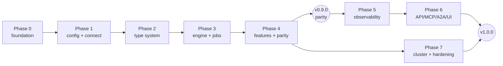

# cdm-rs — Delivery Roadmap (PR plan)

| | |
|---|---|
| **Document** | `docs/ROADMAP.md` |
| **Normative source** | [`SPEC.md`](./SPEC.md) |
| **Traceability** | [`TRACEABILITY.md`](./TRACEABILITY.md) |

Every unit of work below is **one pull request**. Every PR:

* targets `main` via branch protection (no direct pushes, squash merge only);
* is titled with Conventional Commits (`feat(engine): ...`);
* carries an `Implements: <REQ-IDs>` trailer;
* updates `docs/TRACEABILITY.md` in the same PR (CI gate `OPS-011`);
* is green on `ci`, `coverage`, `security`, and — from Phase 2 — `integration` and `sit`;
* is reviewable in isolation: no PR leaves `main` in a non-compiling or non-testable state.

Parity (Phases 1–4) ships **before** the new interface surface (Phases 5–7). That ordering is
deliberate: functional parity is the hard gate, everything else is additive.

## Where delivery has reached

Roadmap PR numbers below are **not** GitHub pull-request numbers; several roadmap items were
delivered as one PR where splitting them would have merged a knowingly-wrong intermediate state.

| Roadmap PRs | State |
|---|---|
| #1–#20, #27–#31, #36–#38 | **Delivered.** Docs and scaffolding, the driver spike, `cdm-core`, all of `cdm-config`, all of `cdm-codec`, `cdm-cql` through statement construction, the CLI skeleton, the testkit, the token planner, the scheduler, and metrics through the event bus. |
| #21–#26 | **Delivered.** The three jobs (migrate with counters, validate with autocorrect, guardrail), run tracking with resume and rerun, the error limit and graceful shutdown. |
| #32–#35, #39–#58 | **Not started.** The SIT parity suite, the property and differential harnesses, `--compat-java`, the terminal UI, the service facade, the API/MCP/A2A/UI surface, the distributed coordinator, and the release machinery. |

**The gap between "delivered" and "usable" is the CLI.** Every job command in `cdm-cli` still
returns "not yet": the jobs are libraries, and the shared *connect → introspect → plan → run* path
they all need has no roadmap PR of its own. It was assumed into #21–#24 and fell between them,
because each job could be built and tested against a `RangeProcessor` seam without it. That work is
tracked as **#21a** below and blocks `cdm migrate`, `cdm validate`, `cdm guardrail` and `cdm plan`.

---

## Phase 0 — Foundation

| PR | Title | Implements | Notes |
|---|---|---|---|
| #1 | `docs: specification, architecture, traceability and repo scaffolding` | — | **This PR.** SPEC/ARCHITECTURE/TRACEABILITY/ROADMAP, ADR-0001 through ADR-0005 and ADR-0009, Cargo workspace with all 16 crates stubbed, workspace lints, `rustfmt.toml`, `clippy.toml`, `deny.toml`, `.pre-commit-config.yaml`, `xtask`, CI workflows, CODEOWNERS, templates, README, LICENSE. |
| #2 | `feat(cql): driver spike — scylla-rust-driver capability assessment` | `CON-000`, `ADR-0002` | Time-boxed spike proving: connect to Cassandra 4.1/5.0 + Scylla + Astra; read/write every CQL type incl. `vector<>`, UDT, tuple, DSE geo; raw-bytes access for passthrough; `UNSET` binding; paging; token-range queries. Produces `ADR-0002` and, if needed, upstream issues. Merged as a documented spike + integration test, not throwaway. |
| #3 | `feat(core): domain vocabulary, error model and plugin registry` | `ERR-001`..`ERR-004`, `PLG-001`..`PLG-013` | `cdm-core`: `TokenRange`, `Record`, `PrimaryKey`, `RunId`, `JobKind`, `RunStatus`, `CdmError`, `Diagnostic`, all plugin traits, `Registry`. 100% unit tested, zero I/O deps. |

## Phase 1 — Configuration and connectivity

| PR | Title | Implements |
|---|---|---|
| #4 | `feat(config): typed config model with generated projections` | `CFG-001`..`CFG-003`, `CFG-100`..`CFG-200` — **also implements `cargo xtask docs` for real** |
| #5 | `feat(config): layered loaders incl. Java .properties compatibility` | `CFG-010`..`CFG-013`, `CLI-002` |
| #6 | `feat(config): three-tier validation with full diagnostic reporting` | `CFG-020`..`CFG-040`, `CFG-161` |
| #7 | `feat(cql): connection building, TLS, keystores` | `CON-001`, `CON-002`, `CON-006`, `CON-007`, `CON-009`, `CON-010` |
| #8 | `feat(cql): Astra secure-connect-bundle, SNI routing and DevOps API` | `CON-003`, `CON-004`, `CON-005`, `CON-020`..`CON-028` |
| #9 | `feat(cql): schema introspection and identifier handling` | `SCH-001`, `SCH-002`, `SCH-010`, `CON-013` |
| #10 | `feat(cli): skeleton binary, config subcommands, exit codes` | `CLI-001`, `CLI-003`..`CLI-007`, `CON-008`, `CON-029`, `SCH-008` |

## Phase 2 — Type system

| PR | Title | Implements |
|---|---|---|
| #11 | `feat(codec): CQL type taxonomy and conversion planner` | `CDC-001`, `CDC-002`, `CDC-010`..`CDC-012`, `CDC-016` |
| #12 | `feat(codec): built-in codec set with Java-identical semantics` | `CDC-020`, `CDC-021`, `CDC-030`, `CDC-031` |
| #13 | `feat(codec): Java date/decimal format translation` | `CDC-022` |
| #14 | `feat(codec): UDT, tuple, collection and vector conversion` | `CDC-004`, `CDC-013`..`CDC-015`, `CDC-032` |
| #15 | `feat(codec): zero-copy passthrough fast path` | `MIG-040`, `TST-030` |
| #16 | `feat(testkit): containers, generators, counter assertions` | `TST-100`..`TST-102` — the `pull_request`/`push` triggers on `integration.yml` were already restored by #2, which gave the workflow something to run first; #16 gives it the shared harness and implements `cargo xtask it` |

## Phase 3 — Core engine and parity jobs

| PR | Title | Implements |
|---|---|---|
| #17 | `feat(engine): token-range planner` | `TOK-001`..`TOK-007`, `TOK-009` |
| #18 | `feat(cql): statement construction and binding` | `SCH-003`..`SCH-007`, `FEA-060`..`FEA-062`, `MIG-010`..`MIG-014`, `ERR-005` |
| #19 | `feat(metrics): counter registry and Java-format reporter` | `MET-001`..`MET-006` |
| #20 | `feat(engine): scheduler, rate limiting, backpressure, failure isolation` | `ENG-001`..`ENG-013` |
| #21 | `feat(engine): migrate job` | `MIG-001`..`MIG-005`, `MIG-020`..`MIG-022`, `MIG-041` |
| #22 | `feat(engine): counter table support` | `SCH-005`, `MIG-030`..`MIG-032`, `CON-011`, `CON-012` |
| #23 | `feat(engine): validate job with autocorrect` | `VAL-001`..`VAL-012`, `VAL-016`, `VAL-017` |
| #24 | `feat(engine): guardrail job` | `GRD-001`..`GRD-004` |
| #25 | `feat(track): run tracking, resume and rerun` | `TRK-001`..`TRK-003`, `TRK-010`, `TRK-012`, `TRK-020`..`TRK-036` |
| #26 | `feat(engine): error limit and graceful shutdown` | `ENG-009`, `ENG-010`, `ENG-014` |
| #21a | `feat(cli): the shared job harness — connect, introspect, plan, run` | `CLI-001`, `CON-008`, `SCH-001`, `SCH-008`, `TOK-001`, `MET-005` (wiring only; no new requirements) — **the one piece standing between the implemented jobs and a usable `cdm` binary.** Turns a validated `CdmConfig` into two sessions, an introspected schema, a conversion plan, a token plan and a scheduler run, then renders the counter block and maps the terminal status onto a `CLI-004` exit code. Wires `cdm migrate`, `cdm validate`, `cdm guardrail`, `cdm plan` and tier-3 `cdm config validate`, all of which currently return "not yet". |

## Phase 4 — Features and parity certification

| PR | Title | Implements |
|---|---|---|
| #27 | `feat(feature): constant columns` | `FEA-010`..`FEA-014` |
| #28 | `feat(feature): explode map` | `FEA-020`..`FEA-023` |
| #29 | `feat(feature): extract JSON` | `FEA-030`..`FEA-035` |
| #30 | `feat(feature): TTL and writetime` | `FEA-040`..`FEA-046` |
| #31 | `feat(feature): filter chain` | `FEA-050`..`FEA-054` |
| #32 | `test(sit): port all 19 Java SIT cases` | `TST-003`, `S1` — **also re-enables the `pull_request`/`push` triggers on `sit.yml`** |
| #33 | `test: property, fault-injection and resume suites` | `TST-010`, `TST-040`, `TST-041` |
| #34 | `test: differential harness against Java CDM` | `TST-020`, `COMPAT-003`, `COMPAT-004` — **also restores the nightly schedule on `differential.yml`** |
| #35 | `feat: --compat-java behaviour bundle + migration guide` | `COMPAT-001`, `COMPAT-002` |

> **Milestone `v0.9.0-parity`** — cut after #35. Success criteria S1, S2, S4 must be met. This is the
> first release usable as a drop-in replacement for Java CDM 6.0.x.

## Phase 5 — Observability

| PR | Title | Implements |
|---|---|---|
| #36 | `feat(metrics): rates, latency histograms, progress and ETA` | `MET-010`, `MET-011` |
| #37 | `feat(metrics): Prometheus and OTLP exporters` | `MET-020`, `MET-021` |
| #38 | `feat(metrics): structured event bus and NDJSON sink` | `MET-030`, `MET-032` |
| #39 | `feat(cli): terminal UI with live progress` | `MET-031` |
| #40 | `feat(validate): machine-readable discrepancy reports` | `VAL-013`, `VAL-015`, `MET-033` |

## Phase 6 — API, MCP, A2A, UI

| PR | Title | Implements |
|---|---|---|
| #41 | `feat(service): transport-agnostic CdmService facade` | `API-009`, `TST-050` groundwork |
| #42 | `feat(api): axum control plane with generated OpenAPI 3.1` | `API-001`..`API-005`, `API-010` — **also implements `cargo xtask openapi` generation and byte-for-byte drift checking** |
| #43 | `feat(api): idempotency, pagination, versioning, SSE` | `API-006`..`API-008`, `VAL-014`, `MET-030` |
| #44 | `feat(api): authentication, TLS, CORS` | `SEC-010`..`SEC-012` |
| #45 | `feat(mcp): MCP server generated from the OpenAPI document` | `MCP-001`..`MCP-006` |
| #46 | `feat(a2a): agent card and task adapter` | `A2A-001`..`A2A-005` |
| #47 | `feat(ui): embedded config builder` | `UI-001`..`UI-004`, `UI-006` |
| #48 | `feat(ui): live run monitoring` | `UI-005` |
| #49 | `test: cross-transport conformance and OpenAPI contract tests` | `TST-050`, `TST-051` |

## Phase 7 — Distribution and hardening

| PR | Title | Implements |
|---|---|---|
| #50 | `feat(cluster): lease-based coordinator` | `DST-001`..`DST-003`, `DST-010`..`DST-013` |
| #51 | `feat(cluster): safe reclaim, counter guard, metric aggregation` | `DST-014`..`DST-018`, `ENG-004` |
| #52 | `test(cluster): multi-node integration with node-death injection` | `DST-019`, `TST-042` |
| #53 | `feat(engine): adaptive rate limiting and adaptive range sizing` | `ENG-006`, `TOK-008`, `TOK-010` |
| #54 | `feat(plugins): runtime plugin loading and example plugin crates` | `PLG-011`, `PLG-012`, `SEC-020` |
| #55 | `perf: benchmark suite and regression gates` | `TST-060`, `NFR-004` — **also restores the nightly schedule on `bench.yml`** |
| #56 | `chore(release): cross-compilation, signing, SBOM, container image` | `NFR-001`, `OPS-020`..`OPS-022`, `SEC-030` |
| #57 | `docs: mdBook user guide, error catalogue, extending guide` | `ERR-003`, `PLG-012`, `NFR-006` |
| #58 | `test: fuzzing targets` | `TST-080` |

> **Milestone `v1.0.0`** — cut after #58. All success criteria S1–S5 met.

---

## Dependency graph

Phases 5 and 7 are parallelisable once Phase 4 lands. Phase 6 depends on Phase 5 for the event
stream that SSE and the UI consume.

---

## CI gates that are deliberately dormant

A workflow that cannot possibly pass is worse than no workflow: it trains reviewers to ignore red.
Four workflows are therefore checked in but restricted to `workflow_dispatch` until the PR that
gives them something to run. Each carries a comment naming that PR, and that PR is responsible for
restoring the triggers.

| Workflow | Dormant until | Reason |
|---|---|---|
| ~~`integration.yml`~~ | ~~#16~~ — **live**, restored early by #2 | the driver spike gave it something to run before #16 did |
| `sit.yml` | #32 | no SIT cases are ported yet |
| `differential.yml` | #34 | no differential harness exists |
| `bench.yml` | #55 | no benchmarks exist |

`cargo xtask openapi --check` and `cargo xtask docs --check` run on every PR from now on, but verify
only what is honestly verifiable today — that the checked-in contract exists, declares OpenAPI 3.1
and is marked generated. Byte-for-byte drift checking arrives with the generators in #4 and #42, and
the commands say so in their own output.

`cargo xtask check-traceability` is fully implemented as of PR #1 and gates every PR.

## Definition of done (per PR)

1. Requirement IDs listed in the `Implements:` trailer and in `docs/TRACEABILITY.md`.
2. Unit tests for every branch; ≥ 90% line coverage for the touched crate. If the change raises
   workspace coverage, raise `COVERAGE_FLOOR` in `.github/workflows/coverage.yml` to match — the
   ratchet only ever tightens (`S4`).
3. Integration test where the change touches a cluster.
4. Rustdoc on every new public item; `#![deny(missing_docs)]` satisfied.
5. Generated artefacts regenerated (`cargo xtask openapi`, `check-generated` green).
6. No new Clippy allowances without a comment justifying them.
7. `docs/MIGRATION_FROM_JAVA.md` updated if behaviour differs from Java.
8. Benchmarks run if the hot path is touched; no > 10% regression.

## Definition of done (per milestone)

1. All PRs in the phase merged and green.
2. Success criteria for that milestone demonstrated and recorded in the release notes.
3. `CHANGELOG.md` regenerated from Conventional Commits, grouped by requirement domain.
4. Release artefacts built, signed, SBOM attached.
5. Traceability report shows zero orphaned or untested requirement IDs for delivered scope.
